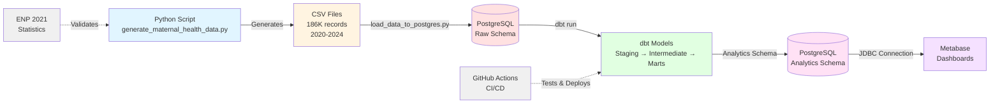

# High-level data pipeline flow

## Key components

**Data generation:**
- Synthetic data based on French National Perinatal Survey 2021
- 5 tables: patients, pregnancies, prenatal_visits, deliveries, birth_outcomes

**Storage:**
- PostgreSQL 14 with 3 schemas: raw, staging, analytics

**Transformation:**
- dbt for data modeling and testing
- Layered approach: Bronze (raw) → Silver (staging) → Gold (analytics)

**Visualization:**
- Metabase for self-service BI dashboards

**Quality assurance:**
- GitHub Actions for automated testing
- dbt tests for data quality