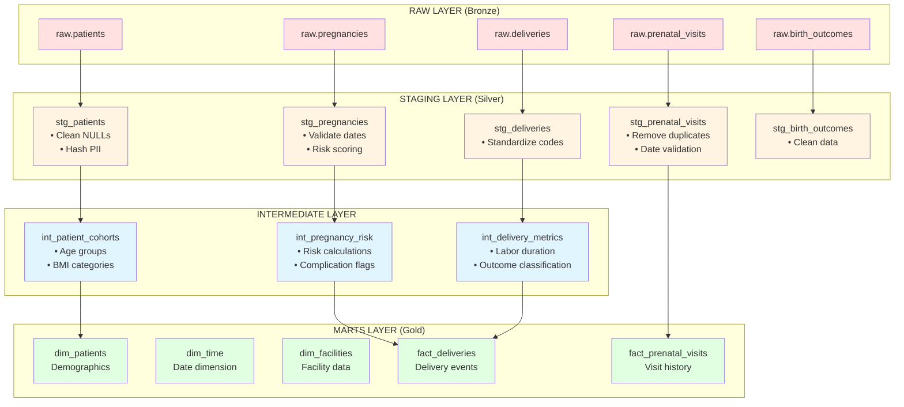

# dbt project architecture

## Layer descriptions

**Raw (Bronze):** Unmodified source data from CSV files

**Staging (Silver):** Cleaned, standardized, deduplicated data with:
- NULL handling
- PII hashing
- Date validation
- Type casting

**Intermediate:** Business logic and calculations:
- Cohort definitions
- Risk scoring
- Metric calculations
- Reusable transformations

**Marts (Gold):** Analytics-ready dimensional models:
- Star schema design
- Denormalized for query performance
- Dashboard-ready metrics