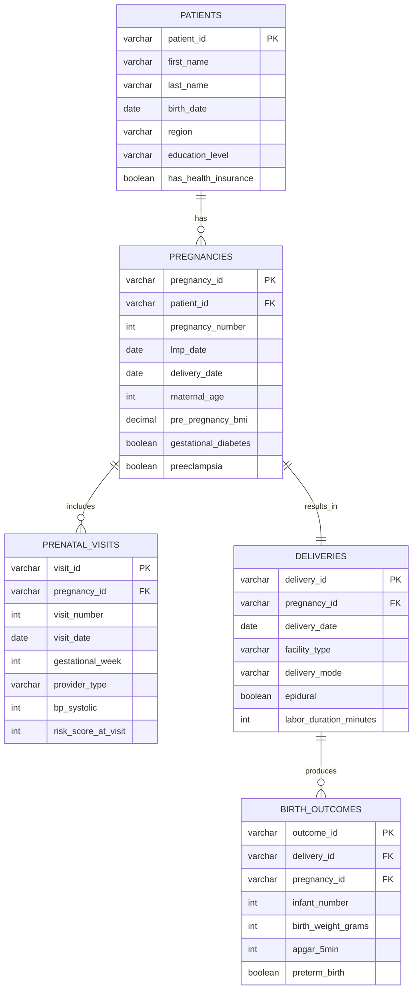

# Entity relationship diagram

## Relationships

**One-to-Many:**
- 1 patient → many pregnancies
- 1 pregnancy → many prenatal visits
- 1 delivery → 1-2 birth outcomes (twins)

**One-to-One:**
- 1 pregnancy → 1 delivery

## Key constraints

- All foreign keys validated in dbt with `relationships` tests
- Primary keys tested for uniqueness
- Date sequences validated (visit before delivery)