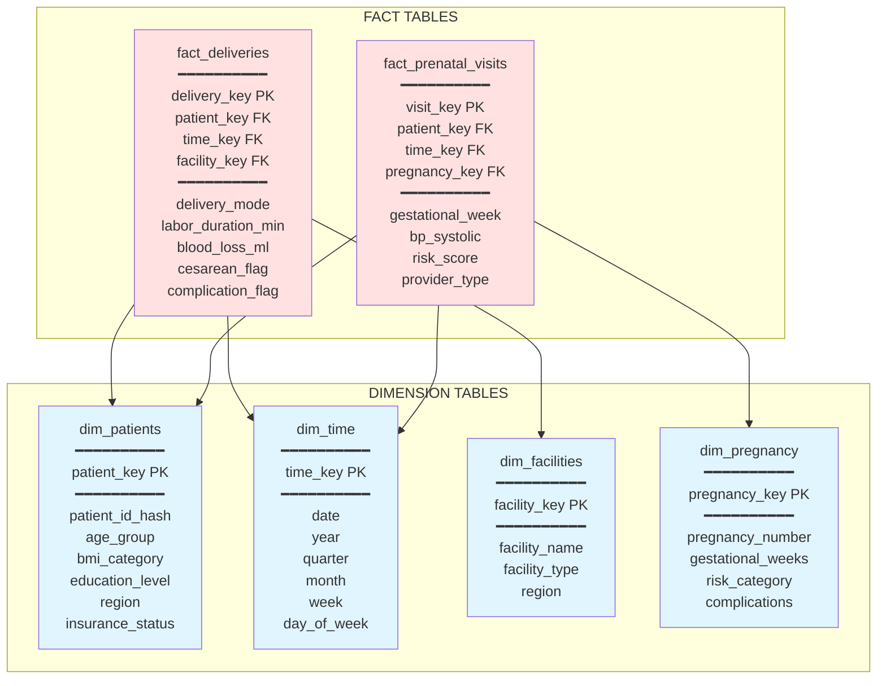

# Dimensional model (Star schema)

## Star schema design

**Fact Tables (Measures):**
- `fact_deliveries`: One row per delivery with metrics
- `fact_prenatal_visits`: One row per visit (117K rows)

**Dimension Tables (Context):**
- `dim_patients`: Who (demographics, age groups, BMI categories)
- `dim_time`: When (date hierarchy for time-series analysis)
- `dim_facilities`: Where (facility types, regions)
- `dim_pregnancy`: What (pregnancy characteristics, risk levels)

## Key features

✅ **Denormalized for performance:** Pre-joined for fast queries  
✅ **Surrogate keys:** Integer keys for efficient joins  
✅ **SCD Type 2 ready:** Track changing risk scores over time  
✅ **Dashboard optimized:** Pre-calculated metrics and categories